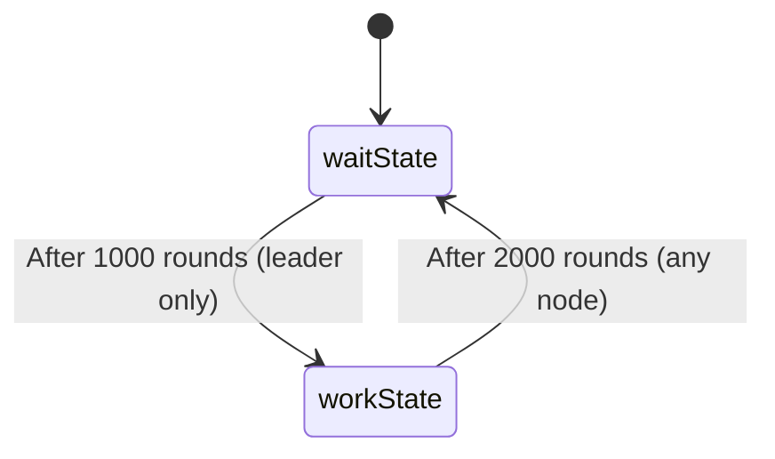
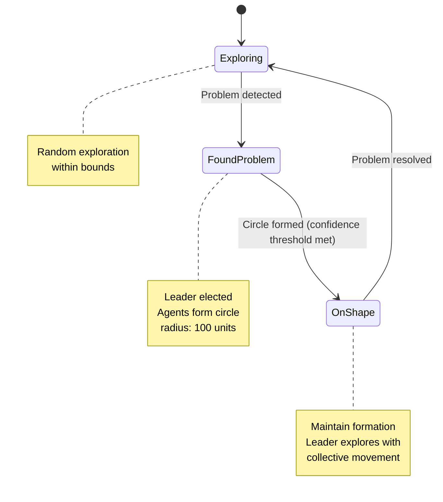

# Collective state machines: Experiments
This repository contains a set of experiments for collective state machines.

## Collective State Machines
Collective state machines are a way to model the behavior of a distributed system where the behavior is express as a collective stance and the transitions between these states are decided by the nodes in the system.

In this experiment, we used aggregate computing to model such collective state machines (please read the paper for more details on the approach).

In `/src/main/scala/it/cfsm/CollectiveFSM/` you can find the implementation of the collective state machines using the `cfsm` library.
It is simply expressed as:
```scala
def cfsm[S: Ordering](initial: S)(logic: S => Next[S]): S = {
    share(History[S](initial)) { (history, nbrHistory) =>
      val maxHistory = foldhood[History[S]](history)(History.max){nbrHistory()}
      val currentState = maxHistory.current.state
      val next = align(currentState) { logic(_) }
      maxHistory.add(next)
    }.current.state
  }
```
Where `S` is the type of the states, `initial` is the initial state, and `logic` is a function that defines the transitions between states.
`S` should be an `Ordering` type to allow the nodes to agree on the current state.
In particular, the nodes will agree on the state with the highest priority (the maximum according to the `Ordering`).
The `logic` function returns a `Next[S]` object that contains the next state and the priority of the transition.
`align` is used to ensure that the node can communicate only when it is in the same state. Two nodes in different states cannot communicate.

## Experiment 1: simple transition between two states
In this experiment, we demonstrate a simple transition between two states in a collective state machine.

### GOAL: 
show a simple transition between two states (`work` and `wait`) showing both transition decided by one node (leader) and by any node.

### How to run?
`./gradlew runSimpleStateMachineGraphic`

### EXPLANATION OF DYNAMICS

- After start (`p` key) the system will start in the `waitState`. 
- After 1000 rounds it will transition to the `workState` (this transition is decided by the node with the ID equals to 0).
- After another 2000 rounds it will transition back to the `waitState` (any node can decide this transition).

### CONTENT

- `/src/main/scala/it/unibo/program/SimpleStateMachine.scala`: it contains the implementation of the simple state machine with `cfsm` library.
- `/src/main/yaml/simpleStateMachine.yaml`: it contains the alchemist configuration for the experiment.

## Experiment 2: collective movement with state-based coordination
In this experiment, we demonstrate a multi-state collective behavior where agents coordinate their movement based on problem detection and collective shape formation.

### GOAL:
Show a complex transition between three states (`Exploring`, `FoundProblem`, and `OnShape`) with leader election and coordinated movement patterns, demonstrating how collective state machines can orchestrate spatial behaviors.

### How to run?
`./gradlew runMovementStateMachineGraphic`


### EXPLANATION OF DYNAMICS

- The system starts in the `Exploring` state, where all agents explore the environment with random movement within bounds.
- if a problem is detected (in this case, for sake of simplicity, after 1000 rounds by node ID 1), the system transitions to the `FoundProblem` state with the detecting node becoming the leader.
- In the `FoundProblem` state, agents form a circle around the leader with a radius of 100 units.
- Once the circle is formed (with sufficient confidence), the system transitions to the `OnShape` state.
- In the `OnShape` state, the collective maintains the circular formation while the leader explores, effectively moving the entire formation.
- After the problem is solved (in this case, after 5000 rounds) in `OnShape` state any node can trigger a transition back to the `Exploring` state.


### CONTENT

- `/src/main/scala/it/unibo/program/MovementStateMachine.scala`: it contains the implementation of the movement-based state machine with `cfsm` library, including three states with different movement behaviors.
- `/src/main/yaml/movementStateMachine.yml`: it contains the alchemist configuration for the experiment. 