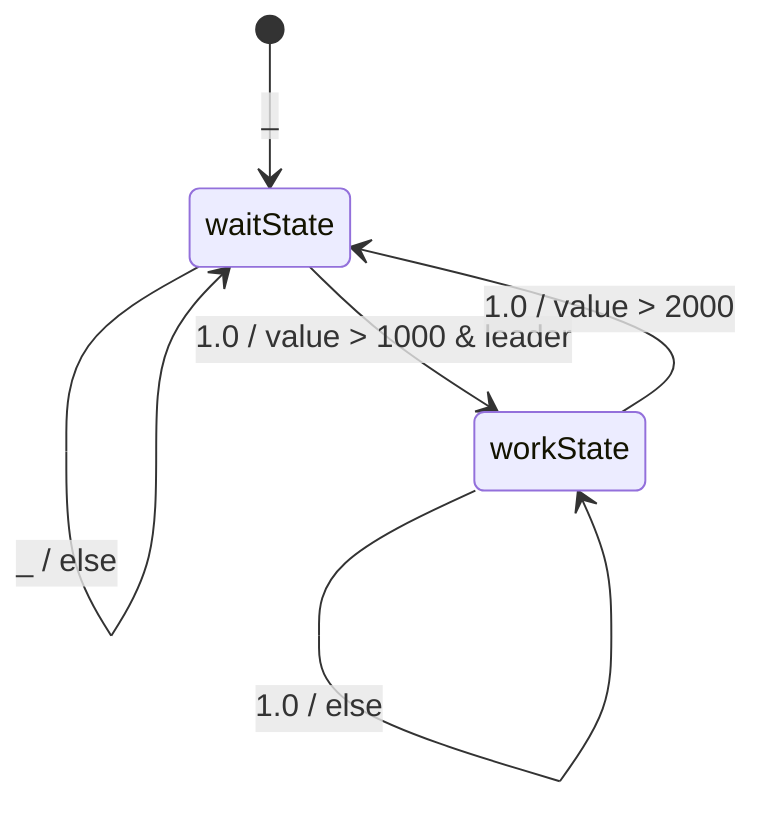
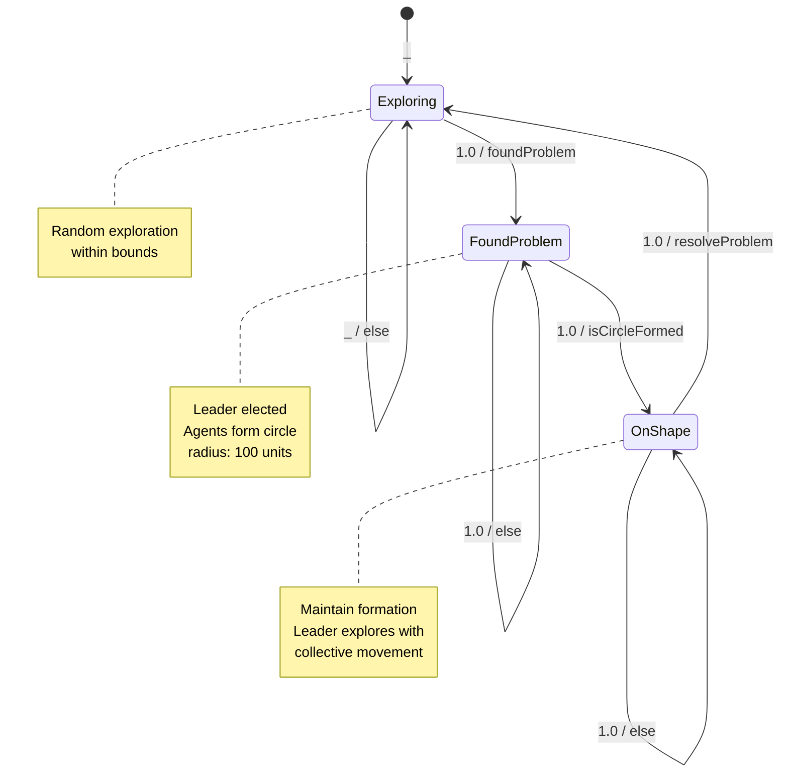
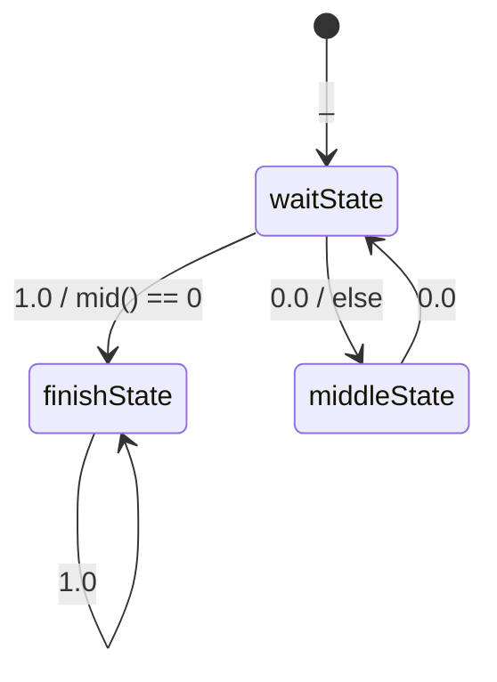

# Collective state machines: Experiments
This repository contains a set of experiments for collective state machines.

## Collective State Machines
Collective state machines are a way to model the behavior of a distributed system where the behavior is express as a collective stance and the transitions between these states are decided by the nodes in the system.

In this experiment, we used aggregate computing to model such collective state machines (please read the paper for more details on the approach).

In `/src/main/scala/it/cfsm/CollectiveFSM/` you can find the implementation of the collective state machines using the `cfsm` library.
It is simply expressed as:
```scala
def cfsm[S: Ordering](initial: S)(logic: S => Next[S]): S = {
    share(History[S](initial)) { (history, nbrHistory) =>
      val maxHistory = foldhood[History[S]](history)(History.max){nbrHistory()}
      val currentState = maxHistory.current.state
      val next = align(currentState) { logic(_) }
      maxHistory.add(next)
    }.current.state
  }
```
Where `S` is the type of the states, `initial` is the initial state, and `logic` is a function that defines the transitions between states.
`S` should be an `Ordering` type to allow the nodes to agree on the current state.
In particular, the nodes will agree on the state with the highest priority (the maximum according to the `Ordering`).
The `logic` function returns a `Next[S]` object that contains the next state and the priority of the transition.
`align` is used to ensure that the node can communicate only when it is in the same state. Two nodes in different states cannot communicate.

## Experiment 1: simple transition between two states
In this experiment, we demonstrate a simple transition between two states in a collective state machine.

`_` means the lowest priority (default transition).
### GOAL: 
show a simple transition between two states (`work` and `wait`) showing both transition decided by one node (leader) and by any node.

### How to run?
`./gradlew runSimpleStateMachineGraphic`

### EXPLANATION OF DYNAMICS

- After start (`p` key) the system will start in the `waitState` (priority `_`).
- Transition to `workState` with priority `1.0` when the round counter (`value`) is greater than 1000 and the node is the leader (`mid() == 0`).
- Transition back to `waitState` with priority `1.0` when the round counter (`value`) is greater than 2000.
- Each state has a self-loop with its own priority value for all other cases.

### CONTENT

- `/src/main/scala/it/unibo/program/SimpleStateMachine.scala`: it contains the implementation of the simple state machine with `cfsm` library.
- `/src/main/yaml/movementStateMachine.yml`: it contains the alchemist configuration for the experiment. 

## Experiment 2: collective movement with state-based coordination
In this experiment, we demonstrate a multi-state collective behavior where agents coordinate their movement based on problem detection and collective shape formation.

### GOAL:
Show a complex transition between three states (`Exploring`, `FoundProblem`, and `OnShape`) with leader election and coordinated movement patterns, demonstrating how collective state machines can orchestrate spatial behaviors.

### How to run?
`./gradlew runMovementStateMachineGraphic`


### EXPLANATION OF DYNAMICS

- The system starts in the `Exploring` state (priority `_`).
- Transition to `FoundProblem` with priority `1.0` when `foundProblem` is true (after 1000 rounds and node ID 1).
- Transition to `OnShape` with priority `1.0` when `isCircleFormed` is true (circle formed with confidence).
- Transition back to `Exploring` with priority `1.0` when `resolveProblem` is true (after 5000 rounds).
- Each state has a self-loop with its own priority value for all other cases.


### CONTENT

- `/src/main/scala/it/unibo/program/MovementStateMachine.scala`: it contains the implementation of the movement-based state machine with `cfsm` library, including three states with different movement behaviors.
- `/src/main/yaml/movementStateMachine.yml`: it contains the alchemist configuration for the experiment. 

## Experiment 3: Branching History
In this experiment, we explore how a collective state machine can handle branching histories, where different subgroups of nodes can temporarily diverge into separate states before potentially reconverging. This scenario models situations where a subset of the collective encounters a local condition that requires a different behavior, creating a temporary "split" in the collective state.

### Goal
Demonstrate the ability of the CFSM framework to manage state divergence and convergence in a distributed system. The goal is to show how a single node's condition (`mid() == 0`) can trigger a global state transition, while other nodes follow a different path, and how the system eventually synchronizes.

### How to run?
`./gradlew runBranchingHistoryMachineGraphic`

### State Machine


### Explanation of Dynamics
- The system starts in the `waitState`.
- If the leader node (`mid() == 0`) is present, it triggers a high-priority transition to the `finishState`. Since this transition has the highest priority (`1.0`), all nodes will eventually adopt the `finishState`.
- If the leader is not present, nodes will transition to the `middleState` with a lower priority (`0.0`).
- From the `middleState`, nodes will transition back to the `waitState`, creating a loop until the leader triggers the final state.
- Once in the `finishState`, the system remains there indefinitely.
- Since there is a split brain (half of the nodes will be detached from the leader), the history will be branching, demonstrating the ability of the CFSM to handle divergent states when the nodes will communicate again and then converge on the `finishState`.
### Content
- `/src/main/scala/it/unibo/program/BranchingHistoryMachine.scala`: Contains the implementation of the branching history state machine.
- `/src/main/yaml/branchingHistoryMachine.yml`: Alchemist configuration for this experiment.
